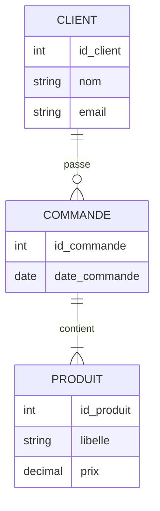

# 🏗️ Les 7 Étapes de la Méthode Merise

### Avec explication détaillée des modèles MCD, MCT, MLD, MOT, MPD, MPT

---

## 🔰 Introduction

La méthode **Merise** est une démarche structurée de **modélisation des systèmes d’information**, née dans les années 1980 en France. Elle est toujours utilisée aujourd’hui dans les administrations publiques, banques, assurances, hôpitaux et grandes entreprises.

### 🧱 Les fondements :

* **Séparation des données et des traitements**
* **Modélisation en trois niveaux** :

  * **Conceptuel** : vision métier indépendante de toute technologie
  * **Logique** : préparation à la mise en œuvre dans un système informatique
  * **Physique** : traduction technique en base de données et applications réelles

---

## 🔁 Vue d’ensemble des étapes Merise

| Étape N° | Étape                                     | Modèle associé | Niveau          | But principal                                      |
| -------- | ----------------------------------------- | -------------- | --------------- | -------------------------------------------------- |
| 1        | Étude préalable                           | Aucun          | Métier          | Identifier les objectifs globaux                   |
| 2        | Étude détaillée                           | Aucun          | Métier          | Analyser le fonctionnement actuel                  |
| 3        | Modèle Conceptuel des Données             | MCD            | Conceptuel      | Décrire les objets métier et leurs relations       |
| 4        | Modèle Conceptuel des Traitements         | MCT            | Conceptuel      | Identifier les processus métiers                   |
| 5        | Modèle Logique des Données                | MLD            | Logique         | Structurer les données pour une base relationnelle |
| 6        | Modèle Organisationnel des Traitements    | MOT            | Organisationnel | Définir qui fait quoi, quand et comment            |
| 7        | Modèles Physiques (Données + Traitements) | MPD / MPT      | Physique        | Implémenter techniquement les modèles précédents   |

---

## 🟢 Étape 1 : **Étude Préalable**

### 🎯 Objectif :

* Poser les fondations du projet
* Définir le périmètre et les enjeux
* Identifier les parties prenantes, contraintes et opportunités
* Estimer la faisabilité et le retour sur investissement

### 📋 Contenu :

* Rédaction d’un **cahier des charges**
* Recensement des **problèmes rencontrés**
* Étude de l’environnement (règlementaire, technique, humain)
* Identification des **processus métiers clés**

### 🧪 Exemple :

Une entreprise artisanale gère les commandes clients par téléphone et les écrit sur des carnets papier. Résultats :

* Perte d’informations fréquente
* Aucune traçabilité des délais de livraison
* Aucune statistique disponible pour l’amélioration continue

### ✅ Bonnes pratiques :

* Réaliser une **analyse SWOT**
* Organiser des **réunions exploratoires avec les dirigeants**
* Identifier les **enjeux stratégiques** (productivité, qualité de service, conformité)

---

## 🟡 Étape 2 : **Étude Détaillée**

### 🎯 Objectif :

* Comprendre le fonctionnement **réel** du système existant
* Analyser les **flux de données, documents, rôles**
* Dresser la **cartographie complète** des opérations métier

### 📋 Contenu :

* Description de l’existant (processus, outils, fichiers)
* Cartographie des flux d’information (internes / externes)
* Détection des **dysfonctionnements** et **points de blocage**
* Identification des **acteurs métier**, des **supports utilisés** et des **documents échangés**

### 🧪 Exemple :

Dans un service RH, les congés sont demandés par e-mail, validés verbalement, puis retranscrits manuellement dans Excel.
Problèmes :

* Retards de traitement
* Litiges fréquents entre managers et employés
* Absence de journalisation des décisions

### ✅ Bonnes pratiques :

* Utiliser des **entretiens semi-directifs**
* Créer un **organigramme fonctionnel**
* Réaliser une **analyse des flux entrants / sortants** et leur utilité réelle

---

## 🧱 Étape 3 : **Modèle Conceptuel des Données (MCD)**

### 🧩 Définition :

Le **MCD** est une représentation **graphique et textuelle** des **objets métier (entités)**, de leurs **caractéristiques (attributs)** et de leurs **liens (relations)**. Il est indépendant de toute logique informatique.

### 📋 Contenu :

* Entités : objets manipulés (Client, Produit, Commande)
* Attributs : informations à mémoriser (nom, prix, date)
* Relations : interactions logiques entre entités
* Contraintes : cardinalités, règles de gestion, identifiants

### 🧪 Exemple :



### ✅ Bonnes pratiques :

* Identifier les **entités stables** et **essentielles au métier**
* Nommer les relations avec des **verbes d’action métiers**
* Éviter les redondances ou les attributs inutiles
* Faire valider le modèle avec les **utilisateurs finaux**

---

## ⚙️ Étape 4 : **Modèle Conceptuel des Traitements (MCT)**

### 🧩 Définition :

Le **MCT** représente les **processus métiers** sous forme de **chaînes de traitements** décrivant les actions et les flux d'information déclenchés par des événements.

### 📋 Contenu :

* Liste des processus métier (enregistrer, valider, envoyer, calculer, etc.)
* Événements déclencheurs (formulaire soumis, événement externe, échéance)
* Résultats attendus (fiche créée, email envoyé, état mis à jour)
* Diagrammes d’activités ou logigrammes

### 🧪 Exemple :

Processus "Créer une commande" :

* Déclenché par : clic sur "Valider le panier"
* Étapes :

  * Vérifier disponibilité
  * Calculer total TTC
  * Générer numéro unique
  * Sauvegarder en base
  * Envoyer confirmation client

### ✅ Bonnes pratiques :

* Définir une **nomenclature cohérente** (Créer, Valider, Supprimer...)
* Relier chaque traitement à une ou plusieurs entités du MCD
* S’assurer que chaque processus est **justifié** par un besoin métier réel

---

## 🧮 Étape 5 : **Modèle Logique des Données (MLD)**

### 🧩 Définition :

Le **MLD** est une **traduction du MCD** dans un formalisme exploitable par un SGBD relationnel. Il structure les **tables**, **clés**, **types de données**, **relations logiques**.

### 📋 Contenu :

* Tables (équivalentes aux entités)
* Champs (attributs transformés en colonnes)
* Clés primaires et étrangères
* Contraintes d’unicité, d’intégrité, de nullabilité

### 🧪 Exemple :

```sql
CREATE TABLE Client (
  id_client INT PRIMARY KEY,
  nom VARCHAR(100),
  email VARCHAR(100)
);

CREATE TABLE Commande (
  id_commande INT PRIMARY KEY,
  date_commande DATE,
  id_client INT,
  FOREIGN KEY (id_client) REFERENCES Client(id_client)
);
```

### ✅ Bonnes pratiques :

* Appliquer les **règles de normalisation** (jusqu’à la 3NF)
* Nommer les tables et champs selon des conventions standard
* Identifier les **colonnes sensibles** à sécuriser (téléphone, email)

---

## 🏢 Étape 6 : **Modèle Organisationnel des Traitements (MOT)**

### 🧩 Définition :

Le **MOT** précise comment les traitements (issus du MCT) sont **réalisés dans l’organisation** : qui les exécute, avec quel outil, à quel moment, selon quelle fréquence.

### 📋 Contenu :

* Déclencheur : formulaire, action utilisateur, système automatique
* Poste acteur : employé, agent, manager, etc.
* Support : interface Web, mobile, papier, scanner
* Fréquence : quotidienne, hebdomadaire, à la demande

### 🧪 Exemple :

* Traitement : Validation de congé
* Déclencheur : employé clique "Envoyer demande"
* Responsable : manager de l’équipe
* Support : application RH
* Fréquence : en temps réel

### ✅ Bonnes pratiques :

* Représenter chaque traitement dans un **workflow ou BPMN**
* Cartographier les **postes** et **canaux utilisés** (email, SMS, mobile)
* Documenter les **retards, conflits, doublons potentiels**

---

## 💾 Étape 7 : **Modèle Physique des Données (MPD)**

## + 🖥️ Modèle Physique des Traitements (MPT)

### 🧩 MPD — Définition :

Le **MPD** est l’implémentation du MLD dans un langage SQL adapté à un SGBD (PostgreSQL, MySQL, Oracle). Il inclut des **optimisations techniques** (index, triggers, partitions).

### 🧩 MPT — Définition :

Le **MPT** est la version **technique** du MCT et MOT. Il inclut les **applications**, **interfaces**, **API**, **scripts**, **batches**, **processus techniques automatisés**.

### 📋 Contenu MPD :

* Scripts de création de base
* Indexation, vues, contraintes techniques
* Chiffrement, droits d’accès

### 📋 Contenu MPT :

* Interfaces Web / mobiles
* API REST, SOAP, GraphQL
* Intégration avec autres systèmes (ERP, IoT, cloud)

### 🧪 Exemple :

* API Python Flask qui valide une commande
* Frontend React qui affiche les commandes
* Script PostgreSQL d’indexation sur `client.nom`

### ✅ Bonnes pratiques :

* Appliquer le principe **DevSecOps** (sécurité dès la conception)
* Automatiser les tests de performance et d’intégration (CI/CD)
* Protéger les données sensibles par **chiffrement et audit**

---

## 🧾 Tableau Récapitulatif des 7 Étapes

| Étape | Modèle    | Objectif principal                               | Exemple concret                        | Bonnes pratiques clés                     |
| ----- | --------- | ------------------------------------------------ | -------------------------------------- | ----------------------------------------- |
| 1     | -         | Définir les besoins globaux                      | Gérer congés dans une PME              | Réunions, SWOT, cahier des charges        |
| 2     | -         | Analyser l’existant                              | Saisie manuelle par email + Excel      | Interviews, cartographie des flux         |
| 3     | MCD       | Décrire les entités et relations                 | Client passe commande                  | Entités claires, cardinalités validées    |
| 4     | MCT       | Décrire les traitements métier                   | Créer / valider commande               | Chaînes de traitement simples et validées |
| 5     | MLD       | Structurer les données pour le SGBD              | Tables SQL : Client, Commande          | Normalisation, nommage cohérent           |
| 6     | MOT       | Décrire les postes, supports et fréquence        | RH valide demande sur Web              | BPMN, calendrier, rôles définis           |
| 7     | MPD / MPT | Implémenter techniquement les modèles précédents | API Flask, index SQL, formulaire React | Sécurité, CI/CD, performance, traçabilité |

---

## ✅ Conclusion

La méthode Merise offre une **vision complète et structurée** pour la modélisation et la mise en œuvre d’un système d’information.
En appliquant rigoureusement les 7 étapes, vous garantissez une solution :

* conforme aux **besoins métiers**,
* **logiquement structurée** et techniquement **robuste**,
* **compréhensible** par toutes les parties prenantes (métier, développeurs, direction).

---

