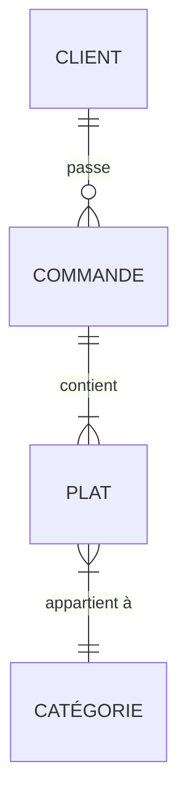
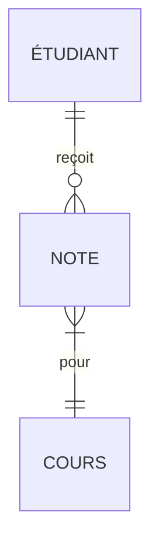
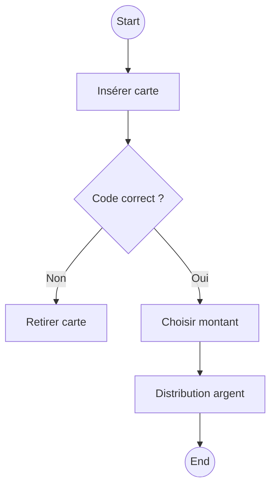

# 🧠 **Synthese  : UML, Merise, BPMN**  
*(Pour les étudiants en informatique qui débutent)*  

---

## 🌟 **Partie 1 : Introduction Interactive**  
### **Analogie Fondamentale**  
Imaginez que vous construisez une maison :  
- **UML** = Les plans des pièces et leurs interactions (où va la cuisine ? comment circuler ?)  
- **Merise** = La liste des matériaux et leur agencement (briques, ciment, tuyaux)  
- **BPMN** = Le déroulement du chantier (étape 1 : fondations → étape 2 : murs...)  

**Exercice Flash** :  
> *Quelle méthode utiliseriez-vous pour...*  
> 1. Montrer comment un client passe commande sur Amazon ? → **BPMN**  
> 2. Décrire les tables d'une base de données de cinéma ? → **Merise**  
> 3. Représenter les fonctionnalités d'une appli de fitness ? → **UML**  

---

## 📚 **Partie 2 : UML Détaillé (Niveau Débutant)**  
### **A. Diagramme de Cas d'Utilisation**  
**Exemple concret** : Application Uber  
- **Acteurs** : Passager, Chauffeur, Système de Paiement  
- **Cas d'utilisation** :  
  ```mermaid
  graph LR
    A[Passager] -->|Commande un trajet| B(Système Uber)
    B --> C[Chauffeur accepte]
    C --> D[Paiement automatique]
  ```  
**Piège à éviter** : Ne pas confondre "acteur" (rôle) et "utilisateur" (personne réelle).  

### **B. Diagramme de Classes**  
**Classe "Livre" dans une bibliothèque** :  
```java
class Livre {
  -String ISBN
  -String titre
  -boolean estEmprunté
  +emprunter()
  +rendre()
}
```  
**Exercice** : Créez une classe "CompteBancaire" avec attributs (solde, numéro) et méthodes (dépenser, créditer).  

---

## 🗃️ **Partie 3 : Merise Pas à Pas**  
### **A. MCD (Modèle Conceptuel de Données)**  
**Règle mnémotechnique** :  
> "Une entité est un nom, une association est un verbe."  

**Exemple : Restaurant**  

**Validation** : Posez-vous : "Un client peut-il passer plusieurs commandes ?" → Oui, donc cardinalité 1-N.  

### **B. MLD → SQL**  
**Transformation guidée** :  
1. Entité "Client" → Table `Client(id_client, nom, email)`  
2. Association "passe" → Clé étrangère `commande.id_client`  

**Exercice** : Transformez ce MCD en tables SQL :  


---

## 🔄 **Partie 4 : BPMN en Pratique**  
### **Scénario : Retrait en Distributeur**  

**Symboles clés** :  
- 🔵 Cercle = Événement  
- 🟦 Rectangle = Tâche  
- 🔶 Losange = Décision  

**Exercice** : Modélisez le processus "Commande de pizza en ligne" avec 3 décisions possibles (paiement OK/échec, stock disponible/rupture).  

---

## 🛠 **Partie 5 : Outils Gratuits + Astuces**  
### **Comparatif Outils**  
| Outil          | Bonus pédagogique                      |  
|----------------|----------------------------------------|  
| **Lucidchart** | Templates prêts pour étudiants        |  
| **Mocodo**     | Génère un MCD à partir de texte       |  
| **UMLet**      | Simple, idéal pour diagrammes UML rapides |  

**Astuce** : Utilisez **Draw.io** avec ces librairies gratuites :  
- `BPMN` : cherchez "BPMN shapes"  
- `UML` : importez la librairie "UML"  

---

## 📝 **Partie 6 : Exercices Avancés (Corrigés Inclus)**  
### **Exercice UML**  
**Problème** : Une animalerie veut une appli de gestion.  
**À faire** :  
1. Listez 3 acteurs (ex : Vétérinaire, Client)  
2. Dessinez 2 cas d'utilisation (ex : "Prendre rendez-vous vaccin")  

### **Exercice Merise**  
**Problème** : Gestion des prêts de matériel de ski.  
**À faire** :  
1. Identifiez 3 entités (ex : Skis, Client, Location)  
2. Dessinez les associations avec cardinalités  

---

## 🔗 **Partie 7 : Synthèse Visuelle**  
**Infographie récapitulative** :  
```plaintext
[UML]          Objets → Diagramme de Classe  
               Interactions → Cas d'Utilisation  
[Merise]       Données → MCD → MLD → SQL  
[BPMN]         Processus → Tâches + Décisions  
```

---

## 💡 **Le Saviez-Vous ?**  
- UML est né dans les années 90 pour unifier les méthodes orientées objet.  
- Merise utilise le **langage SQL** en sortie de modèle logique.  
- BPMN 2.0 permet d'exécuter des processus directement (ex : avec Camunda).  

---
