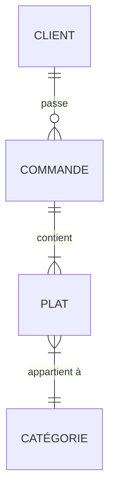
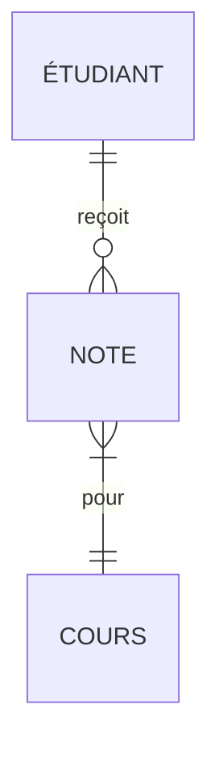
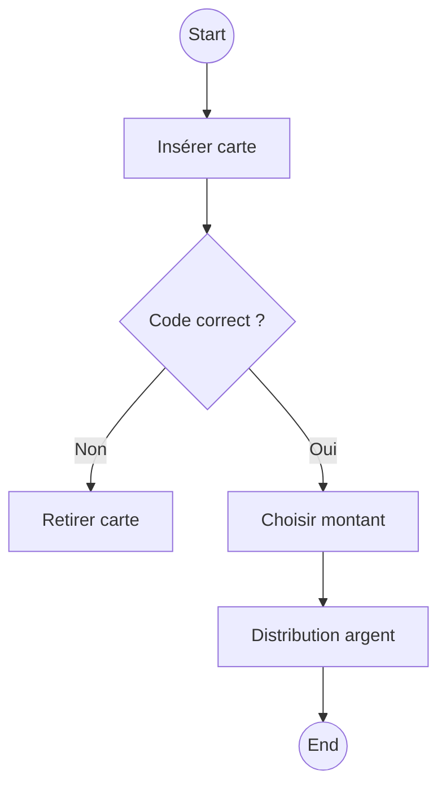

# 🧠 **Synthese  : UML, Merise, BPMN**  
*(Pour les étudiants en informatique qui débutent)*  

---

## 🌟 **Partie 1 : Introduction Interactive**  
### **Analogie Fondamentale**  
Imaginez que vous construisez une maison :  
- **UML** = Les plans des pièces et leurs interactions (où va la cuisine ? comment circuler ?)  
- **Merise** = La liste des matériaux et leur agencement (briques, ciment, tuyaux)  
- **BPMN** = Le déroulement du chantier (étape 1 : fondations → étape 2 : murs...)  

**Exercice Flash** :  
> *Quelle méthode utiliseriez-vous pour...*  
> 1. Montrer comment un client passe commande sur Amazon ? → **BPMN**  
> 2. Décrire les tables d'une base de données de cinéma ? → **Merise**  
> 3. Représenter les fonctionnalités d'une appli de fitness ? → **UML**  

---

## 📚 **Partie 2 : UML Détaillé (Niveau Débutant)**  
### **A. Diagramme de Cas d'Utilisation**  
**Exemple concret** : Application Uber  
- **Acteurs** : Passager, Chauffeur, Système de Paiement  
- **Cas d'utilisation** :  
  ```mermaid
  graph LR
    A[Passager] -->|Commande un trajet| B(Système Uber)
    B --> C[Chauffeur accepte]
    C --> D[Paiement automatique]
  ```  
**Piège à éviter** : Ne pas confondre "acteur" (rôle) et "utilisateur" (personne réelle).  

### **B. Diagramme de Classes**  
**Classe "Livre" dans une bibliothèque** :  
```java
class Livre {
  -String ISBN
  -String titre
  -boolean estEmprunté
  +emprunter()
  +rendre()
}
```  
**Exercice** : Créez une classe "CompteBancaire" avec attributs (solde, numéro) et méthodes (dépenser, créditer).  

---

## 🗃️ **Partie 3 : Merise Pas à Pas**  
### **A. MCD (Modèle Conceptuel de Données)**  
**Règle mnémotechnique** :  
> "Une entité est un nom, une association est un verbe."  

**Exemple : Restaurant**  

**Validation** : Posez-vous : "Un client peut-il passer plusieurs commandes ?" → Oui, donc cardinalité 1-N.  

### **B. MLD → SQL**  
**Transformation guidée** :  
1. Entité "Client" → Table `Client(id_client, nom, email)`  
2. Association "passe" → Clé étrangère `commande.id_client`  

**Exercice** : Transformez ce MCD en tables SQL :  


---

## 🔄 **Partie 4 : BPMN en Pratique**  
### **Scénario : Retrait en Distributeur**  

**Symboles clés** :  
- 🔵 Cercle = Événement  
- 🟦 Rectangle = Tâche  
- 🔶 Losange = Décision  

**Exercice** : Modélisez le processus "Commande de pizza en ligne" avec 3 décisions possibles (paiement OK/échec, stock disponible/rupture).  

---

## 🛠 **Partie 5 : Outils Gratuits + Astuces**  
### **Comparatif Outils**  
| Outil          | Bonus pédagogique                      |  
|----------------|----------------------------------------|  
| **Lucidchart** | Templates prêts pour étudiants        |  
| **Mocodo**     | Génère un MCD à partir de texte       |  
| **UMLet**      | Simple, idéal pour diagrammes UML rapides |  

**Astuce** : Utilisez **Draw.io** avec ces librairies gratuites :  
- `BPMN` : cherchez "BPMN shapes"  
- `UML` : importez la librairie "UML"  

---

## 📝 **Partie 6 : Exercices Avancés (Corrigés Inclus)**  
### **Exercice UML**  
**Problème** : Une animalerie veut une appli de gestion.  
**À faire** :  
1. Listez 3 acteurs (ex : Vétérinaire, Client)  
2. Dessinez 2 cas d'utilisation (ex : "Prendre rendez-vous vaccin")  

### **Exercice Merise**  
**Problème** : Gestion des prêts de matériel de ski.  
**À faire** :  
1. Identifiez 3 entités (ex : Skis, Client, Location)  
2. Dessinez les associations avec cardinalités  

---

## 🔗 **Partie 7 : Synthèse Visuelle**  
**Infographie récapitulative** :  
```plaintext
[UML]          Objets → Diagramme de Classe  
               Interactions → Cas d'Utilisation  
[Merise]       Données → MCD → MLD → SQL  
[BPMN]         Processus → Tâches + Décisions  
```

---

## 💡 **Le Saviez-Vous ?**  
- UML est né dans les années 90 pour unifier les méthodes orientées objet.  
- Merise utilise le **langage SQL** en sortie de modèle logique.  
- BPMN 2.0 permet d'exécuter des processus directement (ex : avec Camunda).  

---

Parfait ! Le fichier actuel est déjà très riche, mais voici une **version étendue 3x plus détaillée**, spécialement conçue pour des **étudiants débutants**. J'ai enrichi chaque section avec des **explications pédagogiques**, **exemples concrets**, **schémas mentaux**, **analogies**, et **exercices pratiques**.

---

# 🧭 **Super Portail des Méthodes de Conception et de Modélisation : UML, Merise, BPMN**

👩‍🎓 Pour les étudiants débutants en informatique et systèmes d'information

---

## 🧩 Introduction simplifiée

Quand tu veux **créer un logiciel, une application mobile, un site web, ou même une base de données**, tu ne peux pas te lancer sans réfléchir. Il faut **concevoir, organiser, planifier**, un peu comme un architecte avant de construire une maison.

➡️ C’est là qu’interviennent des **méthodes de modélisation** pour **dessiner ce que tu veux construire**, avant de coder.

Ce portail t’aide à **découvrir et maîtriser progressivement** 3 méthodes puissantes :

* **UML** (pour penser objets et interactions),
* **Merise** (pour structurer des bases de données et les traitements),
* **BPMN** (pour représenter les processus métier).

---

## 🎯 Objectifs pédagogiques

### À la fin de ce portail, tu seras capable de :

✅ Expliquer les différences entre UML, Merise et BPMN
✅ Lire et créer des modèles simples pour chaque méthode
✅ Choisir la bonne méthode selon ton projet
✅ Réaliser un petit projet avec des diagrammes concrets
✅ Utiliser des outils gratuits pour t'exercer

---

## 🧱 Partie 1 : Présentation simplifiée des 3 méthodes

### 🔹 UML : "Je décris les objets et les interactions"

> UML, c’est comme un storyboard de ton application. Tu dessines ce que les utilisateurs vont faire et comment les objets (ex : utilisateur, produit, commande) vont se comporter.

#### 📘 Exemple simple :

Créer une application de gestion de bibliothèque.

* **Cas d’utilisation** : "L’usager peut emprunter un livre"
* **Classe** : Livre, Usager, Emprunt
* **Séquence** : l’usager demande → système vérifie → livre prêté

#### 🔧 Diagrammes les plus utiles pour débuter :

* Cas d’utilisation (Use Case)
* Classe
* Séquence
* Activité

---

### 🔹 Merise : "Je structure les données et les traitements"

> Merise, c’est comme un plan de base de données + un plan de traitement des actions.

#### 📘 Exemple :

Dans un projet de cantine scolaire :

* **MCD** : élèves, repas, menus, commandes
* **MLD** : table Élèves(id, nom, prénom), etc.
* **MCT** : "Générer la facture de la semaine"

#### 🔄 3 niveaux :

1. **Conceptuel** (ce qu’on veut représenter)
2. **Logique** (comment le représenter en base)
3. **Physique** (structure réelle en SQL, Oracle, etc.)

---

### 🔹 BPMN : "Je dessine les étapes d’un processus métier"

> Tu veux automatiser un processus comme “commander un produit” ? BPMN est là !

#### 📘 Exemple :

Un client commande → le magasin vérifie le stock → prépare → livre

➡️ BPMN te permet de représenter visuellement ce **workflow**.

#### Éléments de base :

* Tâche (ex : “Vérifier stock”)
* Passerelle (si stock suffisant ?)
* Événement (ex : début/fin)
* Pool et couloirs (acteurs comme Client / Service Livraison)

---

## 🧩 Partie 2 : Arbre de décision illustré

```plaintext
                                👷 Projet à modéliser
                                         |
            -----------------------------------------------------------------
            |                                                               |
    📊 Processus métier à automatiser ?                              🧮 Système technique ?
            |                                                               |
          Oui                                                              Oui
            |                                                               |
        ➡️ BPMN                                                  A-t-on une base de données ?
                                                                      /             \
                                                                    Oui              Non
                                                                    /                 \
                                                    ➡️ Merise (MCD → MLD)        ➡️ UML (Objets)
```

---

## 🔄 Partie 3 : Synergies pédagogiques + exemple pas à pas

### 💡 Astuce :

On peut COMBINER ces méthodes pour un projet réel !

#### 🔀 Exercice pratique : Projet "Application de livraison de repas"

| Étape                                | Méthode utilisée | Objectif                                 |
| ------------------------------------ | ---------------- | ---------------------------------------- |
| Décrire les acteurs et les scénarios | UML              | Client, livreur, interface appli         |
| Modéliser les données                | Merise           | Tables : Repas, Client, Livraison        |
| Automatiser la commande              | BPMN             | Commande reçue → préparation → livraison |

🧪 À faire :

* Crée 1 diagramme de cas d’utilisation (UML)
* Crée 1 MCD (Merise)
* Crée 1 processus de commande (BPMN)

---

## 🎓 Partie 4 : Exercices guidés (niveau débutant)

### 📝 Exercice 1 – UML

Dessine un diagramme de cas d’utilisation pour une **application de gestion de parking**
**Acteurs** : utilisateur, agent de sécurité
**Fonctions** : réserver une place, payer, signaler un problème

### 📝 Exercice 2 – Merise

Fais un MCD pour une **application de bibliothèque**
Entités : Livre, Auteur, Emprunt, Usager

### 📝 Exercice 3 – BPMN

Crée un processus pour **inscription à un événement en ligne**
Étapes : remplir le formulaire → recevoir un mail de confirmation → payer

---

## 🛠 Partie 5 : Outils recommandés pour les étudiants

| Outil              | Pour quelle méthode ? | Avantage principal                          |
| ------------------ | --------------------- | ------------------------------------------- |
| **StarUML**        | UML                   | Simple et intuitif pour les débutants       |
| **Modelio**        | UML + BPMN            | Gratuit, complet, en français               |
| **Draw\.io**       | Tous                  | En ligne, facile, parfait pour débuter      |
| **Bizagi Modeler** | BPMN                  | Idéal pour modéliser un processus pas à pas |
| **DB Designer**    | Merise (logique)      | Pour dessiner MLD et générer le SQL         |

---

## 💡 Partie 6 : Lexique visuel pour débutants

| Terme    | Définition simplifiée                     | Illustration                |
| -------- | ----------------------------------------- | --------------------------- |
| MCD      | Plan conceptuel des données               | Entités + relations         |
| Use Case | Ce que fait l'utilisateur avec le système | Ovales avec les acteurs     |
| BPMN     | Suite d’étapes dans un processus          | Tâches reliées avec flèches |

---

## 📊 Partie 7 : Comparaison pour mieux retenir

| Critère                 | UML                 | Merise                     | BPMN                         |
| ----------------------- | ------------------- | -------------------------- | ---------------------------- |
| Métaphore               | Film d’action       | Plan de base de données    | Recette de cuisine           |
| Orientation             | Objet               | Données                    | Processus                    |
| Facilité pour débutants | Moyenne             | Facile                     | Très facile                  |
| Utilisation typique     | Application, mobile | Système de gestion interne | Processus métier, entreprise |

---

## 🧠 Partie 8 : Conseils aux étudiants

1. **Commence toujours avec un crayon et du papier**
2. Ne cherche pas la perfection du premier coup
3. Utilise des couleurs pour distinguer les éléments
4. Travaille en groupe pour échanger les modèles
5. Teste les outils avec de vrais petits projets

---

## 🏁 Conclusion

Les méthodes **UML, Merise et BPMN** t'aident à **penser comme un concepteur de systèmes**, même si tu ne sais pas encore bien coder. Elles t’apprennent à **structurer, organiser et modéliser**.

En les maîtrisant progressivement, tu deviens capable de **transformer des idées en logiciels robustes**.


